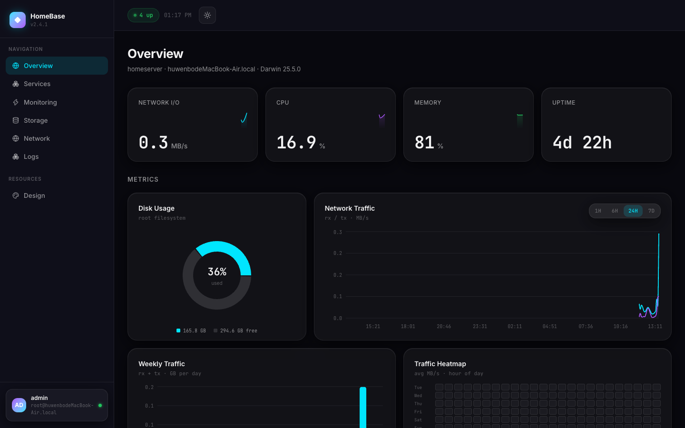
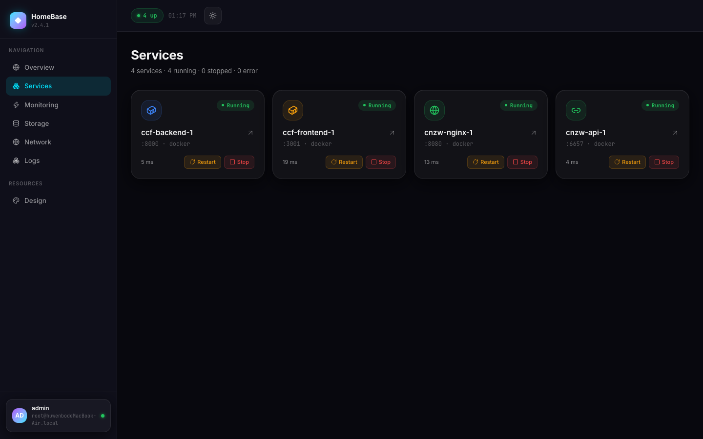
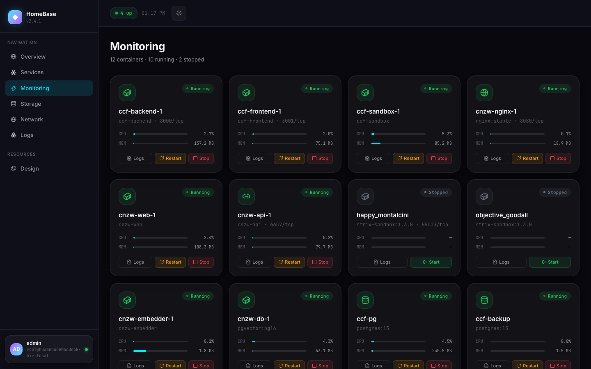
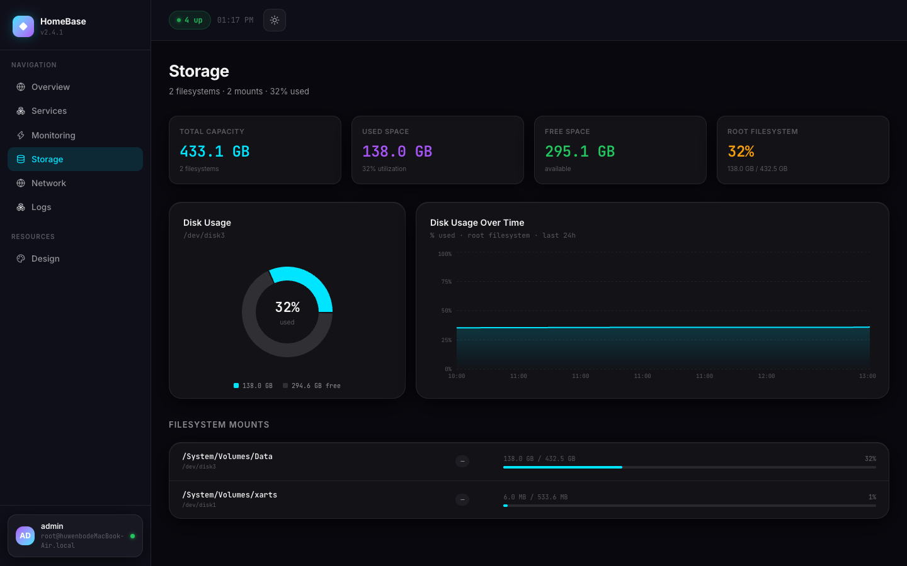
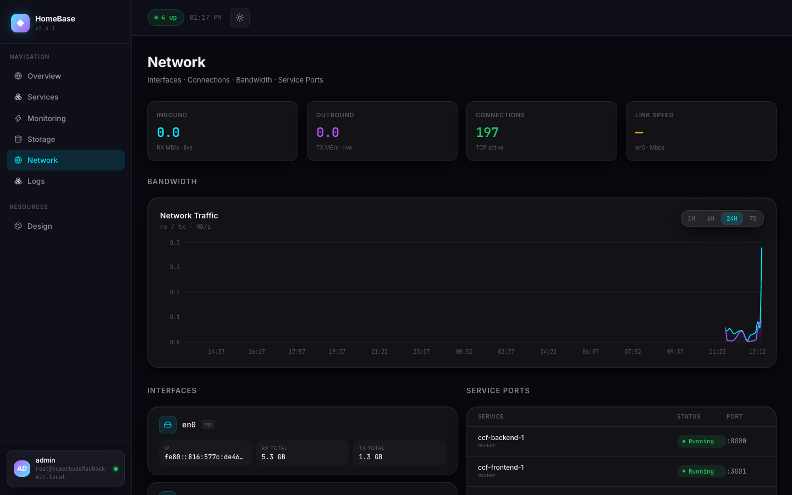
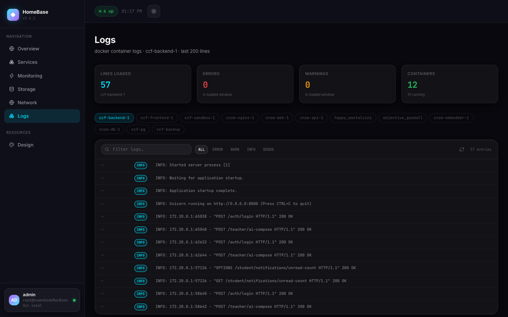
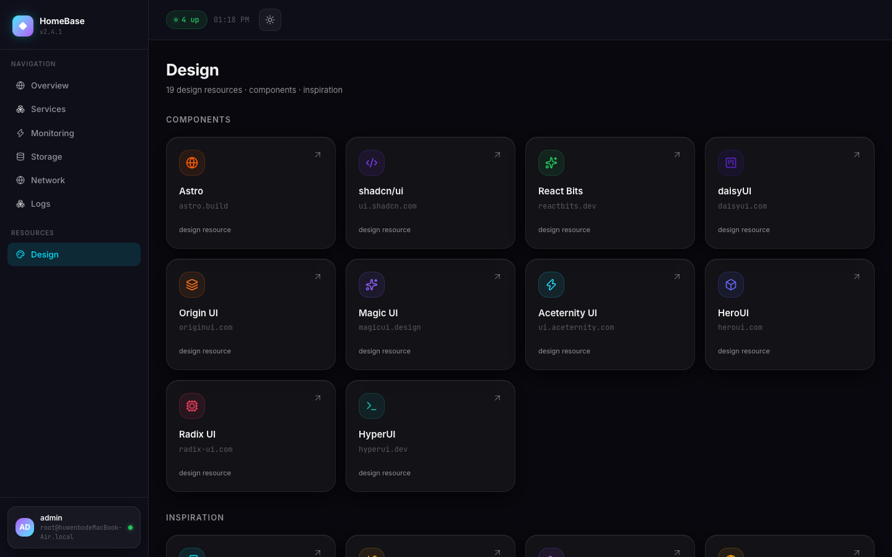

# HomeBase · 自托管服务器主页

[English](README.md) | [简体中文](README.zh-CN.md)

[](https://react.dev)
[](https://vite.dev)
[](https://tailwindcss.com)
[](https://hono.dev)
[](https://docker.com)

## 这是什么

一个为家庭服务器打造的玻璃拟态主页：用一页回答"服务都活着吗，机器健康吗"。Hono 后端直接读宿主机 `/proc` / `/sys`（开发时自动走 macOS 回退），每秒采样、保留 30 天 JSONL 历史、逐个探测服务、直连 Docker socket —— React 前端只负责呈现。无需装 agent、无需数据库、无需配置文件。

| 总览 · KPI + 图表 | 服务 · 自动发现 |
| --- | --- |
|  |  |
| **监控 · 容器** | **存储 · 挂载** |
|  |  |
| **网络 · 接口** | **日志 · 流** |
|  |  |
| **设计 · 资源** | |
|  | |

## 功能

- **零配置服务目录** —— 有发布端口的运行中 Docker 容器自动发现（按镜像名推断图标和配色）；`backend/config/services.json` 的手动条目优先于发现结果，并携带精选元数据。
- **真实主机指标** —— CPU / 内存 / 负载 / TCP / 运行时长 / 网络计数每秒从 PID 1 的 `/proc`（宿主网络命名空间）采样，Darwin 回退（`vm_stat`、`ps`、`netstat`、`sysctl`）让同一份代码能在 Mac 上跑。
- **30 天历史** —— 指标按天写 JSONL 文件，按窗口降采样（1h / 6h / 24h / 7d，各约 300 个桶），驱动迷你走势、流量面积图、周柱状图和 GitHub 风格热力图。
- **容器控制** —— 每容器实时 CPU / 内存，日志流带级别解析与过滤，启停/重启按钮直连 Docker socket。
- **存储与网络视图** —— `statfs` 读取真实文件系统挂载（过滤虚拟文件系统），网卡含链路状态、速率、地址和开机累计流量。
- **细节** —— 深浅双主题、hash 路由（深链接刷新不丢）、250ms 视图过渡、图表跟随主题、尊重 `prefers-reduced-motion`。

## 快速开始

```bash
# 后端（API 端口 :8787）
cd backend && npm install
npm run dev

# 前端（Vite :5173，/api 代理到 :8787）
npm install
npm run dev
```

部署预构建镜像（API 与静态 SPA 同端口提供）：

```bash
docker run -d --name homebase \
  -p 8787:8787 \
  -v /var/run/docker.sock:/var/run/docker.sock \
  -v /proc:/host/proc:ro \
  -v /sys:/host/sys:ro \
  -e HOST_PROC=/host/proc -e HOST_SYS=/host/sys \
  ghcr.io/unborracho/homebase:latest
```

直接跑在宿主机上时读的就是 `/proc` 和 `/sys` —— 只有在容器里才需要挂载。Node ≥ 22。

## 结构

```
backend/src/
  index.ts    # Hono 路由 + SPA fallback
  metrics.ts  # 每秒主机采样（Linux /proc//sys，Darwin 回退）
  history.ts  # JSONL 历史，按窗口降采样
  recorder.ts # 指标写入 data/hist-YYYY-MM-DD
  docker.ts   # 容器列表/状态/日志/操作 + 自动发现
  probe.ts    # 服务 HTTP 探测（5s 缓存，3s 超时）
  storage.ts  # statfs 真实挂载，过滤虚拟文件系统
  network.ts  # 网卡、计数器、默认路由
  config.ts   # services.json 目录（SERVICES_CONFIG 覆盖）
src/
  App.tsx     # hash 路由视图，250ms 视图过渡
  components/dashboard/   # 每路由一个视图 + 共享卡片
  components/dashboard/charts/  # recharts 封装，跟随主题
  lib/        # api 请求、usePoll、格式化、图标
public/design-resources.json   # Design 页链接目录（改文件不改代码）
```

关键开关：`PORT`、`HOST_PROC` / `HOST_SYS` / `HOST_FS`（容器内挂宿主路径）、`PROBE_HOST`（默认 `host.docker.internal`，本地开发用 `127.0.0.1`）、`DATA_DIR`、`SERVICES_CONFIG`。

## 许可

MIT。
